< · Next.js 16 (App Router) · Supabase SSR · React 19 · TypeScript · Tailwind v4 · shadcn/ui

---

# Part 1: Product Requirements Document (PRD)

---

## 1.1 Executive Summary

**Linalyze** is an interactive, high-end linear algebra visualization platform that bridges the gap between abstract matrix operations and geometric 3D intuition by letting users input systems of linear equations, perform row operations step-by-step, and watch the corresponding planes, lines, and intersection points animate in real-time within a photorealistic Three.js canvas. By combining an "eMathHelp"-style algebraic solver with a live React-Three-Fiber scene, Linalyze transforms what is traditionally a blackboard-and-chalk exercise into an immersive, explorable 3D experience.

---

## 1.2 User Personas

### 🎓 Student (Learner)

| Attribute       | Detail |
|-----------------|--------|
| **Who**         | Undergraduate (18–24 yrs) in STEM (Engineering, CS, Mathematics, Physics) |
| **Pain Point**  | Cannot visualize what "eliminating a variable" means geometrically; row reduction feels purely mechanical |
| **Goal**        | Understand *why* Gaussian elimination works by seeing planes tilt, merge, or become parallel in 3D |
| **Tech Level**  | Comfortable with browser apps; may use on tablets during lectures |
| **Key Metric**  | Time-to-insight: < 30 seconds from inputting an equation to seeing the first plane rendered |

### 🧑‍🏫 Educator (Presenter)

| Attribute       | Detail |
|-----------------|--------|
| **Who**         | University lecturer or teaching assistant presenting linear algebra concepts |
| **Pain Point**  | Static slides and 2D diagrams fail to convey 3D intersections; live coding demos are fragile |
| **Goal**        | Project Linalyze on a lecture screen, walk through row operations live, and save "Equation Sets" for reuse |
| **Tech Level**  | Moderate; needs a zero-config, shareable link experience |
| **Key Metric**  | Preparation-to-presentation time: < 5 minutes to set up a demo system |

---

## 1.3 User Stories (Top 5 Critical Flows)

| #  | As a...    | I want to...                                                                                  | So that...                                                                                   | Priority |
|----|------------|-----------------------------------------------------------------------------------------------|----------------------------------------------------------------------------------------------|----------|
| US-1 | Student  | Input a system of 2–4 linear equations with up to 3 variables via a clean equation editor     | I can see the system rendered instantly as colored planes in a 3D scene                       | **P0**   |
| US-2 | Student  | Perform a manual row operation (swap, scale, add-multiple) by clicking a button               | I can watch the corresponding plane animate to its new position with a step-by-step text explanation | **P0**   |
| US-3 | Student  | Trigger an animated "Auto-Solver" that performs full Gauss-Jordan elimination                  | I can observe every intermediate step, with a timeline scrubber to replay at my own pace      | **P0**   |
| US-4 | Educator | Save the current system (coefficients + row-op history) to my Supabase account                | I can reload it during a lecture without re-entering equations                                 | **P1**   |
| US-5 | Student  | See a textual, "eMathHelp"-style explanation panel beside the 3D canvas                       | I understand the algebraic reasoning (e.g., "Multiply R₁ by ½") alongside the visual change  | **P1**   |

---

## 1.4 Feature Prioritization (MoSCoW)

### ✅ Must Have (MVP — Sprint 1–3)

| Feature                        | Description |
|--------------------------------|-------------|
| **Equation Input Panel**       | A form supporting 2D (2 vars) and 3D (3 vars) systems with up to 6 equations. Renders in real-time. |
| **Three.js / R3F 3D Canvas**   | React-Three-Fiber scene rendering semi-transparent planes, intersection lines, and solution points with orbit controls. |
| **Manual Row Operation Engine**| UI buttons for the three elementary row operations: `Rᵢ ↔ Rⱼ` (swap), `kRᵢ → Rᵢ` (scale), `Rᵢ + kRⱼ → Rᵢ` (add-multiple). Each triggers a state transition and animation. |
| **Math.js Logic Engine**       | Core computation layer using [Math.js](https://mathjs.org/) for matrix arithmetic, fraction handling, and validation. |
| **Step-by-Step State Manager** | A reducer-based state machine that records every intermediate augmented matrix as a snapshot, forming the "history" of the solve process. |

### 🟡 Should Have (Sprint 4–5)

| Feature                            | Description |
|------------------------------------|-------------|
| **eMathHelp-Style Explanations**   | Each row operation produces a LaTeX-rendered text explanation (e.g., "$R_2 \\leftarrow R_2 - 3R_1$") displayed in a side panel. |
| **User Accounts & Saved Systems**  | Supabase Auth (email/password + OAuth) with a `saved_systems` table to persist equation sets. |
| **Auto-Solver with Timeline**      | Full Gauss-Jordan auto-solve with play/pause/scrub controls. Animations interpolate at configurable speed. |
| **Dark/Light Mode**                | Leverages `next-themes` from the starter kit. Canvas background adapts. |

### 🔵 Could Have (Sprint 6+)

| Feature                              | Description |
|--------------------------------------|-------------|
| **Vector Space Basis Visualization** | Visualize column space, null space, and basis vectors as arrows in the 3D scene. |
| **4D Projection Experiments**        | Render 4-variable systems by projecting hyperplanes into 3D via user-controlled projection axes. |
| **Shareable Links**                  | Generate unique URLs that encode the entire system state for classroom sharing. |
| **Collaborative Mode**               | Real-time multi-user sessions via Supabase Realtime subscriptions. |

### 🔴 Won't Have (Out of Scope)

| Exclusion                          | Rationale |
|------------------------------------|-----------|
| Eigenvalue solvers for matrices > 10×10 | Performance on client-side JS is prohibitive; not core to the geometric visualization mission. |
| Full LU/QR/SVD decomposition UI  | Out of scope for the current product; may be a future "Advanced" module. |
| Mobile-native app (iOS/Android)  | Web-first strategy; responsive design covers tablet usage. |

---

# Part 2: High-Level Design (HLD)

---

## 2.1 System Architecture Diagram

```mermaid
flowchart TD
    subgraph "Client — Next.js 16 App Router"
        A["📝 Equation Input Panel\n(React Form + shadcn/ui)"]
        B["🧮 Math.js Logic Engine\n(Validation · RREF · Fraction Arithmetic)"]
        C["📜 Step-by-Step State Manager\n(useReducer + Snapshot Stack)"]
        D["🎬 React-Three-Fiber Renderer\n(3D Planes · Lines · Points · Animations)"]
        E["📖 Explanation Panel\n(LaTeX via KaTeX · Step Text)"]
        F["🎛️ Toolbar\n(Row Ops · Auto-Solve · Undo/Redo)"]
    end

    subgraph "Backend — Supabase"
        G["🔐 Supabase Auth\n(Email · OAuth · RLS)"]
        H["🗄️ Supabase PostgreSQL\n(profiles · saved_systems · step_history)"]
        I["📡 Supabase Realtime\n(Future: Collaboration)"]
    end

    subgraph "Infrastructure"
        J["▲ Vercel\n(Edge Runtime · CDN · Analytics)"]
        K["🔧 GitHub Actions\n(CI: Type-check · Lint · Test)"]
    end

    A -->|"raw coefficients\n+ constants"| B
    B -->|"validated AugmentedMatrix"| C
    C -->|"current snapshot\n{ matrix, planes[] }"| D
    C -->|"step description"| E
    F -->|"dispatchRowOp(action)"| C
    C -->|"re-compute geometry"| B
    G -->|"session JWT"| H
    H -->|"load/save"| C
    J -->|"hosts"| A
    K -->|"CI/CD"| J
```



### Data Flow Summary

```
User Input → Math.js Validation → State Manager (Snapshot Push) → R3F Renderer (Animate)
                                      ↕
                               Supabase (Persist)
```

---

## 2.2 Database Design (Supabase)

### Schema Concept

#### Table: `profiles`

Extends the Supabase `auth.users` table with application-specific metadata.

| Column         | Type         | Constraints              | Description                                  |
|----------------|--------------|--------------------------|----------------------------------------------|
| `id`           | `uuid`       | PK, FK → `auth.users.id`| One-to-one link to auth user                 |
| `display_name` | `text`       | NOT NULL                 | User's chosen display name                   |
| `avatar_url`   | `text`       | NULLABLE                 | Profile picture URL                          |
| `role`         | `text`       | DEFAULT `'student'`      | Enum: `student`, `educator`                  |
| `created_at`   | `timestamptz`| DEFAULT `now()`          | Account creation timestamp                   |
| `updated_at`   | `timestamptz`| DEFAULT `now()`          | Last update timestamp                        |

#### Table: `saved_systems`

Stores complete equation system snapshots.

| Column           | Type         | Constraints              | Description                                              |
|------------------|--------------|--------------------------|----------------------------------------------------------|
| `id`             | `uuid`       | PK, DEFAULT `gen_random_uuid()` | Unique system identifier                        |
| `user_id`        | `uuid`       | FK → `profiles.id`, NOT NULL | Owner of this saved system                          |
| `title`          | `text`       | NOT NULL                 | User-given name (e.g., "3x3 Unique Solution Example")   |
| `description`    | `text`       | NULLABLE                 | Optional notes                                           |
| `num_variables`  | `smallint`   | NOT NULL, CHECK (2–4)    | Number of variables (dimensions)                         |
| `num_equations`  | `smallint`   | NOT NULL, CHECK (1–6)    | Number of equations                                      |
| `coefficients`   | `jsonb`      | NOT NULL                 | `{"matrix": [[1,2,3],[4,5,6]], "constants": [7,8]}`      |
| `metadata`       | `jsonb`      | NULLABLE                 | Tags, color preferences, camera position                 |
| `is_public`      | `boolean`    | DEFAULT `false`          | Whether publicly shareable                               |
| `created_at`     | `timestamptz`| DEFAULT `now()`          |                                                          |
| `updated_at`     | `timestamptz`| DEFAULT `now()`          |                                                          |

#### Table: `step_history`

Records the row-operation history for replayable sessions.

| Column           | Type         | Constraints              | Description                                              |
|------------------|--------------|--------------------------|----------------------------------------------------------|
| `id`             | `uuid`       | PK, DEFAULT `gen_random_uuid()` | Unique step identifier                          |
| `system_id`      | `uuid`       | FK → `saved_systems.id`, NOT NULL | Parent system                              |
| `step_index`     | `smallint`   | NOT NULL                 | Ordinal position in the solve sequence (0-based)         |
| `operation_type` | `text`       | NOT NULL                 | Enum: `swap`, `scale`, `add_multiple`, `initial`         |
| `operation_params`| `jsonb`     | NOT NULL                 | e.g., `{"source_row": 0, "target_row": 1, "scalar": -3}`|
| `matrix_snapshot`| `jsonb`      | NOT NULL                 | Full augmented matrix state after this operation         |
| `explanation`    | `text`       | NOT NULL                 | Human-readable description (e.g., "R₂ ← R₂ − 3R₁")     |
| `created_at`     | `timestamptz`| DEFAULT `now()`          |                                                          |

### Row-Level Security (RLS) Policies

```sql
-- profiles: Users can only read/update their own profile
ALTER TABLE profiles ENABLE ROW LEVEL SECURITY;
CREATE POLICY "Users can view own profile" ON profiles FOR SELECT USING (auth.uid() = id);
CREATE POLICY "Users can update own profile" ON profiles FOR UPDATE USING (auth.uid() = id);

-- saved_systems: Owners have full CRUD; public systems are readable by all
ALTER TABLE saved_systems ENABLE ROW LEVEL SECURITY;
CREATE POLICY "Owner full access" ON saved_systems USING (auth.uid() = user_id);
CREATE POLICY "Public read" ON saved_systems FOR SELECT USING (is_public = true);

-- step_history: Access via parent system ownership
ALTER TABLE step_history ENABLE ROW LEVEL SECURITY;
CREATE POLICY "Owner access via system" ON step_history
  USING (EXISTS (SELECT 1 FROM saved_systems WHERE saved_systems.id = step_history.system_id AND saved_systems.user_id = auth.uid()));
```

### ER Diagram


---

## 2.3 Data Flow — Lifecycle of a Row Operation

The following describes the complete journey from a user clicking "Apply Row Operation" to the 3D canvas updating:

```mermaid
sequenceDiagram
    participant U as User
    participant UI as Row Op Toolbar
    participant SM as State Manager<br/>(useReducer)
    participant ME as Math Engine<br/>(math.js)
    participant R3F as R3F Canvas
    participant SP as Explanation Panel
    participant DB as Supabase DB

    U->>UI: Clicks "R₂ ← R₂ − 3R₁"
    UI->>SM: dispatch({ type: 'ADD_MULTIPLE', payload: { target: 1, source: 0, scalar: -3 } })

    SM->>ME: applyRowOperation(currentMatrix, action)
    ME-->>ME: Validate operation (non-zero scalar, valid indices)
    ME-->>SM: Return { newMatrix, explanation: "R₂ ← R₂ − 3R₁" }

    SM-->>SM: Push snapshot to history stack
    SM-->>SM: Compute plane equations from new matrix rows
    SM->>R3F: Update plane geometries (via React state)

    R3F-->>R3F: useFrame() animates planes<br/>from old → new positions<br/>(lerp over 600ms)

    SM->>SP: Emit step explanation + LaTeX string
    SP-->>SP: Render via KaTeX

    opt User is authenticated & auto-save enabled
        SM->>DB: INSERT INTO step_history (...)
    end
```



### Step-by-step detail:

1. **UI Capture**: User selects operation type, source/target rows, and scalar from dropdown/inputs in the toolbar.
2. **Dispatch**: A `RowOperationAction` is dispatched to the `useReducer`-based state manager.
3. **Validation**: The Math Engine validates the operation (e.g., scalar ≠ 0, row indices in bounds).
4. **Compute**: The new augmented matrix is computed using Math.js fraction arithmetic for exact results.
5. **Snapshot**: The state manager pushes the result onto a history stack (enabling undo/redo).
6. **Geometry Update**: New plane normal vectors (`[a, b, c]`) and offsets (`d`) are derived from each row `ax + by + cz = d`.
7. **Animation**: React-Three-Fiber's `useFrame` hook interpolates (lerps) each plane from its old orientation/position to the new one over ~600ms.
8. **Explanation**: A human-readable string (with LaTeX) is rendered in the side panel via KaTeX.
9. **Persist** (optional): If the user is logged in and auto-save is enabled, the step is written to `step_history`.

---

## 2.4 Integration Map

| Dependency               | Purpose                                | Version Strategy    | Import Path                        |
|--------------------------|----------------------------------------|---------------------|------------------------------------|
| **Supabase Auth**        | User registration, login, OAuth, JWTs  | `@supabase/ssr ^0.8`| `src/supabase/client.ts`, `server.ts` |
| **Supabase PostgreSQL**  | Persistent storage (profiles, systems, history) | Managed by Supabase | Via Supabase client                |
| **Three.js**             | Low-level 3D rendering engine          | `^0.170.x`          | Peer dep of R3F                    |
| **React-Three-Fiber**    | React declarative wrapper for Three.js | `^8.x`              | `@react-three/fiber`               |
| **@react-three/drei**    | R3F helpers (OrbitControls, Text, Grid) | `^9.x`              | `@react-three/drei`                |
| **Math.js**              | Matrix ops, fraction arithmetic, expression parsing | `^13.x` | `mathjs`                          |
| **KaTeX**                | Fast LaTeX rendering for math equations | `^0.16.x`           | `katex` + `react-katex`           |
| **Lucide React**         | Icon library (already in starter)      | `^0.562.x`          | `lucide-react`                     |
| **shadcn/ui**            | Accessible UI components (already in starter) | Latest       | `@/components/ui/*`                |
| **TanStack Query**       | Server state management for Supabase queries | `^5.x`         | `@tanstack/react-query`           |
| **next-themes**          | Dark/light mode toggle (already in starter) | `^0.4.x`       | `next-themes`                      |
| **Framer Motion**        | UI panel transitions and micro-animations | `^11.x`          | `framer-motion`                    |

---

# Part 3: Architecture Decision Records (ADR)

---

## ADR-001: Visual Engine — React-Three-Fiber over Vanilla WebGL

### Context

Linalyze requires a 3D rendering engine capable of:
- Rendering semi-transparent planes, lines, and points
- Smooth animation of plane transformations (position, rotation, opacity)
- Orbit camera controls, grid helpers, and axis labels
- Integration within a Next.js 16 App Router component tree

### Decision

**Use React-Three-Fiber (R3F)** as the primary visual engine, rather than vanilla Three.js/WebGL or alternative libraries (Babylon.js, Deck.gl).

### Rationale

| Criterion                  | Vanilla Three.js | React-Three-Fiber | Babylon.js    |
|----------------------------|------------------|--------------------|---------------|
| React integration          | Manual imperative bridge, lifecycle pain | Native — components *are* scene objects | Requires wrapper |
| Next.js SSR compatibility  | Requires `dynamic(() => import(...), { ssr: false })` | Same, but well-documented pattern | Less community support |
| Declarative animation      | Manual `requestAnimationFrame` loops | `useFrame` hook + React state drives animation | Imperative API |
| Ecosystem (drei, postprocessing) | N/A | Rich library of helpers (`OrbitControls`, `Text`, `Grid`, `Html`) | Built-in but different API |
| Bundle size                | ~150KB (three.js core) | +~20KB (fiber overhead) | ~800KB+ |
| TypeScript support         | Good | Excellent (typed JSX intrinsics) | Good |
| Community/Docs             | Huge | Large, React-focused | Large, game-focused |

**Key advantages for Linalyze**:

1. **Declarative scene graph**: Each plane is a `<mesh>` component whose props (`position`, `rotation`, `material.opacity`) are driven by React state. When the state manager produces a new matrix snapshot, React reconciles the scene automatically — no imperative `scene.remove()` / `scene.add()` needed.

2. **Animation via `useFrame`**: The `useFrame` hook runs on every animation frame, allowing smooth `lerp()` interpolation of plane transforms. This is far more maintainable than a custom animation loop.

3. **Colocated logic**: Event handlers (`onClick`, `onPointerOver`) live on the `<mesh>` JSX, enabling features like click-to-select a plane for highlighting.

4. **@react-three/drei**: Provides `<OrbitControls>`, `<Grid>`, `<Text>`, and `<Html>` (for in-scene annotations), eliminating weeks of boilerplate.

### Consequences

- R3F components must be rendered client-side only (`'use client'` + `dynamic` import with `ssr: false`).
- Three.js becomes a peer dependency, adding ~170KB to the client bundle (mitigated by code-splitting the `/solver` route).
- Team members need familiarity with both React and Three.js concepts.

### Status: **Accepted**

---

## ADR-002: "eMathHelp" Solver Logic — Custom Iterative Gauss-Jordan

### Context

The core differentiator of Linalyze is not merely *solving* a linear system, but providing **step-by-step snapshots** with human-readable explanations. A black-box `math.rref(matrix)` call returns only the final result.

### Decision

**Implement a custom iterative Gauss-Jordan elimination** function that yields intermediate states, rather than using Math.js's built-in black-box solver.

### Rationale

```
Black-box approach:
  Input → rref() → Output
  (No intermediate state. No explanation.)

Custom iterative approach:
  Input → Step 1 → Step 2 → ... → Step N → Output
  (Each step = { matrix, operation, explanation })
```

**Why custom?**

1. **Step-by-step snapshots**: The solver is implemented as a **generator function** (`function*`) that `yield`s after every elementary row operation. Each yielded value contains:
   - The current augmented matrix state
   - The operation performed (`{ type, params }`)
   - A human-readable explanation string (with LaTeX)
   - Plane equation parameters derived from the current matrix

2. **Partial pivoting**: The custom solver can implement partial pivoting (selecting the largest absolute value in the pivot column) and explain *why* it chose a particular pivot, aiding learning.

3. **Fraction arithmetic**: By using `math.fraction()` throughout, the solver avoids floating-point errors. Students see exact values like `1/3` instead of `0.33333...`.

4. **Configurable strategy**: The solver can be parameterized to use forward elimination only (echelon form) or full Gauss-Jordan (RREF), letting users explore both approaches.

5. **Text generation**: Each operation maps to a template:
   - Swap: `"Swap R_{i+1} and R_{j+1}"`
   - Scale: `"Multiply R_{i+1} by {scalar}"`
   - Add-multiple: `"R_{i+1} ← R_{i+1} + ({scalar}) · R_{j+1}"`

### Pseudocode

```
function* gaussJordanSolver(augmentedMatrix):
    yield { matrix: clone(augmentedMatrix), operation: "initial", explanation: "Initial system" }

    for col = 0 to min(rows, cols-1):
        // Partial pivot: find row with largest |value| in column
        pivotRow = findBestPivot(matrix, col)
        if pivotRow ≠ col:
            swapRows(matrix, col, pivotRow)
            yield { matrix: clone(matrix), operation: "swap", ... }

        // Scale pivot to 1
        pivotVal = matrix[col][col]
        if pivotVal ≠ 0 and pivotVal ≠ 1:
            scaleRow(matrix, col, 1/pivotVal)
            yield { matrix: clone(matrix), operation: "scale", ... }

        // Eliminate all other entries in this column
        for row = 0 to rows-1:
            if row ≠ col and matrix[row][col] ≠ 0:
                factor = -matrix[row][col]
                addMultiple(matrix, row, col, factor)
                yield { matrix: clone(matrix), operation: "add_multiple", ... }

    yield { matrix: clone(matrix), operation: "complete", explanation: "RREF achieved" }
```

### Consequences

- Higher implementation effort vs. a black-box call (~200 LOC for the solver + ~100 LOC for explanation templates).
- Must maintain test parity with known RREF results (edge cases: zero rows, all-zero columns, singular systems).
- Allows future extension to other decompositions (LU, etc.) using the same generator pattern.

### Status: **Accepted**

---

## ADR-003: State Management — useReducer + Undo/Redo History Hook

### Context

Row operations form a linear sequence of transformations. Users need to:
1. Apply operations and see the result
2. Undo the last operation (and see the previous state re-animated)
3. Redo a previously undone operation
4. Scrub to any arbitrary point in the history (timeline slider)

### Decision

**Use a custom `useHistory` hook** built on `useReducer`, implementing a **stack-based undo/redo pattern**.

### Rationale

#### Why not Zustand / Redux / Jotai?

The state in question is **local to the solver page** — it doesn't need to be shared across routes or persist across navigation (unless explicitly saved to Supabase). A `useReducer` with a custom hook is the lightest, most testable approach.

#### Architecture

```typescript
interface HistoryState {
  past: Snapshot[];      // Undo stack
  present: Snapshot;     // Current state
  future: Snapshot[];    // Redo stack
}

type HistoryAction =
  | { type: 'APPLY_ROW_OP'; payload: RowOperation }
  | { type: 'UNDO' }
  | { type: 'REDO' }
  | { type: 'JUMP_TO'; payload: { index: number } }
  | { type: 'RESET'; payload: { initial: Snapshot } };
```

#### Behavior

| Action          | Effect on `past`           | Effect on `present`       | Effect on `future`        |
|-----------------|----------------------------|---------------------------|---------------------------|
| `APPLY_ROW_OP`  | Push old `present`         | New computed snapshot     | **Cleared** (branch cut)  |
| `UNDO`          | Pop last                   | Popped value              | Push old `present`        |
| `REDO`          | Push old `present`         | Popped from `future`      | Pop first                 |
| `JUMP_TO(n)`    | Set to `history[0..n-1]`   | Set to `history[n]`       | Set to `history[n+1..]`   |
| `RESET`         | Clear                      | Set to payload            | Clear                     |

#### Memory optimization

Each `Snapshot` stores the full augmented matrix (small: a 6×4 `number[][]` is ~200 bytes). Even 1,000 steps is only ~200KB — negligible. No need for a diff-based approach.

### Consequences

- Simple, testable, zero-dependency solution.
- The `JUMP_TO` action enables the timeline scrubber feature.
- Future migration to Zustand (if global state is needed) is trivial — the reducer logic is portable.

### Status: **Accepted**

---

# Part 4: UX & UI Workflows

---

## 4.1 Primary User Journey — The "Solver" Flow

```mermaid
flowchart LR
    A["🏠 Landing Page"] -->|"CTA: 'Start Solving'"| B["📝 Equation Input"]
    B -->|"Submit 3-var system"| C["🖥️ Solver Workspace"]

    subgraph "Solver Workspace (Split View)"
        direction TB
        C1["Left: Augmented Matrix\n+ Row Op Controls"]
        C2["Right: 3D Canvas\n(Planes, Intersections)"]
        C3["Bottom: Step Explanation\n(LaTeX + Text)"]
        C1 --- C2
        C1 --- C3
    end

    C --> C1
    C --> C2
    C --> C3

    C1 -->|"Apply Row Op"| D["🔄 Animate Transition"]
    D --> C2
    D --> C3

    C1 -->|"Auto-Solve"| E["⏯️ Timeline Player"]
    E -->|"Play/Pause/Scrub"| D

    C1 -->|"Save System"| F["💾 Supabase Save"]
    F -->|"Confirm"| C1
```



### Workspace Layout

```
┌─────────────────────────────────────────────────────────┐
│  🧬 Linalyze                    [Dark/Light] [Save] [⚙]│
├──────────────────────┬──────────────────────────────────┤
│                      │                                  │
│   Augmented Matrix   │     3D Canvas (R3F)              │
│   ┌─────────────┐    │     ┌────────────────────┐       │
│   │ 1  2  3 | 6 │    │     │  🟦 Plane 1        │       │
│   │ 0  1  2 | 4 │    │     │  🟩 Plane 2        │       │
│   │ 0  0  1 | 2 │    │     │  🟥 Plane 3        │       │
│   └─────────────┘    │     │     ⬤ Solution      │       │
│                      │     └────────────────────┘       │
│   Row Operations:    │     [Orbit] [Reset Camera] [Grid]│
│   [Swap R1↔R2]       │                                  │
│   [Scale R1 × __]    │                                  │
│   [R2 + __·R1 → R2]  │                                  │
│                      │                                  │
│   [▶ Auto-Solve]     │                                  │
│   [↩ Undo] [↪ Redo]  │                                  │
├──────────────────────┴──────────────────────────────────┤
│  Step 3 of 7: R₂ ← R₂ − 3R₁                           │
│  "Subtract 3 times Row 1 from Row 2 to eliminate x₁"   │
│  ◀ ●───────────●─────────── ▶  [⏯ Play]  [Speed: 1x]   │
└─────────────────────────────────────────────────────────┘
```

---

## 4.2 Step-by-Step Visualization

### UI Synchronization Protocol

When a row operation is applied, the following happens **simultaneously** across all three panels:

| Panel               | Update                                                                |
|----------------------|-----------------------------------------------------------------------|
| **Matrix Panel**     | Affected rows highlight (pulse amber), then update to new values with a brief fade-in |
| **3D Canvas**        | Affected planes smoothly rotate/translate from old to new geometry over 600ms. Other planes dim slightly to draw focus. |
| **Explanation Panel**| New step card slides in from the bottom with: (1) LaTeX operation notation, (2) Plain-English description, (3) Step counter |

### Animation Timeline


---

## 4.3 Error States

### 4.3.1 Singular Matrix — No Unique Solution

```mermaid
flowchart TD
    A["User inputs dependent equations"] --> B["Solver detects zero-pivot row"]
    B --> C{"Classification"}
    C -->|"0 = nonzero (e.g., 0 = 5)"| D["🔴 No Solution\n(Inconsistent System)"]
    C -->|"0 = 0 (free variable)"| E["🟡 Infinite Solutions\n(Parametric Form)"]

    D --> F["3D Canvas: Planes shown as\nparallel / non-intersecting\nwith red glow effect"]
    D --> G["Explanation Panel:\n'This system is inconsistent.\nRow k reveals 0 = c where c ≠ 0.\nThe planes do not share a common point.'"]

    E --> H["3D Canvas: Intersection line\nhighlighted in yellow\n(planes intersect in a line, not a point)"]
    E --> I["Explanation Panel:\n'This system has infinitely many solutions.\nThe solution set is a line (or plane) in ℝ³.\nParametric form: x = ...'"]
```



### 4.3.2 Invalid Equation Syntax

| Error Type              | Example Input       | UI Response                                                                 |
|-------------------------|---------------------|-----------------------------------------------------------------------------|
| Non-numeric coefficient | `ax + 2y = 5`       | Red border on input field; tooltip: "Coefficients must be numeric"          |
| Missing `=` sign        | `2x + 3y`           | Inline error beneath the field: "Each equation must contain '='"            |
| Wrong variable count    | `2x + 3y + z = 5` in a 2D system | Warning badge: "This equation has 3 variables but the system is set to 2D" |
| Division by zero (scale)| User enters scalar `0` for a scale operation | Button disabled; tooltip: "Scalar cannot be zero"            |

### 4.3.3 Edge Case Visualizations

| Scenario                 | 3D Representation                                         |
|--------------------------|-----------------------------------------------------------|
| 2 planes, parallel       | Two colored planes rendered with matching normals, slight separation, labeled "∥" |
| 3 planes, line intersection | Three planes with a highlighted yellow intersection line                         |
| 3 planes, point intersection | Three planes with a glowing white sphere at the solution point                  |
| 2D mode (2 variables)   | Birds-eye-view of lines in a 2D plane (orthographic camera)                      |

---

# Part 5: Project SOPs (Standard Operating Procedures)

---

## SOP-001: Starter Integration — Initializing from `supa-next-starter`

### Purpose

Standardize the process of bootstrapping the Linalyze project from the upstream starter template.

### Procedure

```bash
# 1. Clone the starter into the project directory
pnpm create next-app -e https://github.com/michaeltroya/supa-next-starter ./linalyze
cd linalyze

# 2. Rename environment file and configure Supabase credentials
cp .env.example .env.local
# Edit .env.local:
#   NEXT_PUBLIC_SUPABASE_URL=https://<project-ref>.supabase.co
#   NEXT_PUBLIC_SUPABASE_PUBLISHABLE_KEY=<your-anon-key>

# 3. Install Linalyze-specific dependencies
pnpm add three @react-three/fiber @react-three/drei mathjs katex react-katex framer-motion
pnpm add -D @types/three @types/katex

# 4. Verify the starter runs
pnpm dev
# Open http://localhost:3000 — expect the default SupaNext landing page

# 5. Clean up boilerplate
#    - Remove/replace src/app/page.tsx content with Linalyze landing page
#    - Keep: layout.tsx (providers, fonts, themes), auth routes, supabase/ utils
#    - Remove: demo Todo components if present
```

### Directory Scaffold for Linalyze

After cleanup, the `src/` directory should be organized as:

```
src/
├── app/
│   ├── (auth)/                    # Auth routes (from starter)
│   │   ├── login/page.tsx
│   │   ├── signup/page.tsx
│   │   └── auth/callback/route.ts
│   ├── (main)/                    # Main app routes
│   │   ├── layout.tsx             # Authenticated layout with nav
│   │   ├── page.tsx               # Landing / Dashboard
│   │   └── solver/
│   │       ├── page.tsx           # Solver workspace (main feature)
│   │       └── loading.tsx        # Suspense boundary
│   ├── layout.tsx                 # Root layout (providers, fonts)
│   └── globals.css
├── components/
│   ├── ui/                        # shadcn/ui components (from starter)
│   ├── solver/
│   │   ├── EquationInput.tsx      # Equation entry form
│   │   ├── AugmentedMatrix.tsx    # Matrix display with highlighting
│   │   ├── RowOpToolbar.tsx       # Row operation controls
│   │   ├── ExplanationPanel.tsx   # Step-by-step text + LaTeX
│   │   └── TimelineSlider.tsx     # Auto-solve playback controls
│   ├── canvas/
│   │   ├── Scene.tsx              # R3F Canvas wrapper
│   │   ├── Plane3D.tsx            # Individual plane mesh
│   │   ├── IntersectionPoint.tsx  # Solution point sphere
│   │   ├── IntersectionLine.tsx   # Solution line geometry
│   │   ├── AxisLabels.tsx         # x, y, z axis labels
│   │   └── GridHelper.tsx         # 3D grid floor
│   └── layout/
│       ├── Navbar.tsx             # Top navigation bar
│       ├── SplitView.tsx          # Resizable left/right split
│       └── Footer.tsx
├── lib/
│   ├── math/
│   │   ├── solver.ts              # Gauss-Jordan generator function
│   │   ├── matrix-utils.ts        # Matrix helpers (clone, validate, etc.)
│   │   ├── plane-geometry.ts      # Convert matrix row → 3D plane params
│   │   ├── fraction-utils.ts      # Math.js fraction wrappers
│   │   └── explanation.ts         # Step explanation template engine
│   └── types/
│       ├── matrix.ts              # Snapshot, RowOperation, AugmentedMatrix
│       └── solver.ts              # SolverStep, SolverResult, SolutionType
├── hooks/
│   ├── useHistory.ts              # Undo/redo history hook
│   ├── useSolver.ts               # Auto-solve controller hook
│   ├── usePlaneAnimation.ts       # R3F animation interpolation hook
│   └── useSavedSystems.ts         # TanStack Query hook for Supabase CRUD
├── supabase/                      # Supabase utilities (from starter)
│   ├── client.ts
│   ├── server.ts
│   └── proxy.ts
├── providers/                     # Context providers (from starter)
│   └── query-provider.tsx
└── utils/                         # General utilities (from starter)
```

### Checklist

- [ ] `.env.local` configured with Supabase URL and key
- [ ] `pnpm dev` runs without errors
- [ ] Auth flow (login/signup) works end-to-end
- [ ] Supabase migrations applied (see SOP-002)
- [ ] Boilerplate demo components removed
- [ ] Linalyze-specific dependencies installed
- [ ] TypeScript compiles cleanly (`pnpm type-check`)

---

## SOP-002: Mathematical Documentation Standards

### Purpose

Ensure mathematically precise code comments and documentation so that the 3D visualization always matches the underlying algebra.

### Standards

#### 1. LaTeX in Code Comments

All mathematical formulas in source code must use LaTeX notation within JSDoc/TSDoc comments:

```typescript
/**
 * Converts an augmented matrix row to 3D plane parameters.
 *
 * Given a row [a, b, c | d] representing the equation:
 *   \( ax + by + cz = d \)
 *
 * The plane normal vector is \( \vec{n} = (a, b, c) \).
 * The signed distance from origin is \( d / \|\vec{n}\| \).
 *
 * @param row - Array of 4 numbers [a, b, c, d]
 * @returns PlaneParams { normal: Vector3, distance: number, equation: string }
 */
function rowToPlane(row: number[]): PlaneParams { ... }
```

#### 2. Naming Conventions

| Math Concept               | Code Symbol          | Example                         |
|----------------------------|----------------------|---------------------------------|
| Augmented matrix           | `augMatrix`          | `const augMatrix: number[][]`   |
| Row index (0-based)        | `rowIdx` or `i`      | `matrix[i]`                     |
| Column index               | `colIdx` or `j`      | `matrix[i][j]`                  |
| Scalar multiplier          | `scalar` or `k`      | `scaleRow(matrix, i, k)`        |
| Pivot element              | `pivot`              | `const pivot = matrix[col][col]`|
| Normal vector of a plane   | `normal`             | `new Vector3(a, b, c)`         |
| Row Echelon Form           | `REF`                | Comment: `// Achieve REF`       |
| Reduced Row Echelon Form   | `RREF`               | Comment: `// Achieve RREF`      |

#### 3. Test Case Documentation

Every solver test case must document:
- The input system of equations (in mathematical notation)
- The expected RREF
- The expected solution type (unique / infinite / none)
- The expected number of steps

```typescript
/**
 * Test: 3×3 system with unique solution.
 *
 * System:
 *   x + 2y + 3z = 14
 *   2x + 5y + 6z = 30
 *   3x + y + z = 10
 *
 * Expected RREF:
 *   [1, 0, 0, | 1]
 *   [0, 1, 0, | 2]
 *   [0, 0, 1, | 3]
 *
 * Solution: (x, y, z) = (1, 2, 3) — unique
 * Expected steps: 8 (including initial)
 */
test('3x3 unique solution', () => { ... });
```

#### 4. Physics↔Math Invariant

The following invariant must hold at all times and should be validated by a test:

> **For every row `i` in the current augmented matrix `[aᵢ, bᵢ, cᵢ | dᵢ]`, the rendered 3D plane `i` satisfies the equation `aᵢx + bᵢy + cᵢz = dᵢ`.**

This means:
- Any point on the rendered plane, when substituted into the equation, must equal `dᵢ` (within floating-point tolerance).
- The plane's visual normal must be parallel to `(aᵢ, bᵢ, cᵢ)`.

---

## SOP-003: Deployment — Vercel + Supabase CI/CD Pipeline

### Purpose

Define the deployment and continuous integration strategy for production-grade releases.

### Architecture


### Pipeline Stages

| Stage              | Trigger                       | Actions                                                        | Failure Policy             |
|--------------------|-------------------------------|----------------------------------------------------------------|----------------------------|
| **Lint**           | Every push / PR               | `pnpm lint` — ESLint 9 flat config                             | Block merge                |
| **Type Check**     | Every push / PR               | `pnpm type-check` — `tsc --noEmit`                             | Block merge                |
| **Unit Tests**     | Every push / PR               | `pnpm test:ci` — Vitest (solver logic, hooks, components)      | Block merge                |
| **Build**          | Every push / PR               | `pnpm build` — Next.js production build                        | Block merge                |
| **Preview Deploy** | PR opened/updated             | Vercel auto-preview at `linalyze-<branch>.vercel.app`          | Non-blocking (informational) |
| **Prod Deploy**    | Merge to `main`               | Vercel auto-production deploy                                  | Rollback on failure        |
| **DB Migration**   | Merge to `main` (if changed)  | Supabase migration applied via CLI or dashboard                | Manual verification        |

### Environment Variables

| Variable                               | Where               | Purpose                            |
|----------------------------------------|----------------------|------------------------------------|
| `NEXT_PUBLIC_SUPABASE_URL`             | Vercel + `.env.local`| Supabase project URL               |
| `NEXT_PUBLIC_SUPABASE_PUBLISHABLE_KEY` | Vercel + `.env.local`| Supabase anon/publishable key      |
| `SUPABASE_SERVICE_ROLE_KEY`            | Vercel (secret)      | Server-side admin operations       |
| `NEXT_PUBLIC_VERCEL_ANALYTICS_ID`      | Vercel (auto)        | Vercel analytics tracking          |

### Branching Strategy

| Branch          | Purpose                                      | Deploys To         |
|-----------------|----------------------------------------------|--------------------|
| `main`          | Production-ready code                        | Production         |
| `develop`       | Integration branch for feature merges        | Staging preview    |
| `feat/*`        | Individual feature branches                  | PR preview         |
| `fix/*`         | Bug fix branches                             | PR preview         |

### Database Migration Workflow

```bash
# 1. Create a new migration locally
supabase migration new add_step_history_table

# 2. Write SQL in supabase/migrations/<timestamp>_add_step_history_table.sql

# 3. Test locally
supabase db reset   # Replays all migrations on local DB
pnpm test:ci        # Ensure app works with new schema

# 4. Push to feature branch → Supabase linked preview branch auto-applies migration

# 5. On merge to main → Apply migration to production
supabase db push --linked
```

---

# Appendix A: Technology Compatibility Matrix

| Technology             | supa-next-starter Version | Linalyze Required Version | Compatible? |
|------------------------|---------------------------|---------------------------|-------------|
| Next.js                | 16.1.1                    | 16.x                     | ✅           |
| React                  | 19.2.3                    | 19.x                     | ✅           |
| Supabase JS            | 2.89.0                    | 2.x                      | ✅           |
| Supabase SSR           | 0.8.0                     | 0.8.x                    | ✅           |
| Tailwind CSS           | 4.1.18                    | 4.x                      | ✅           |
| TypeScript             | 5.9.3                     | 5.x                      | ✅           |
| TanStack Query         | 5.90.12                   | 5.x                      | ✅           |
| Lucide React           | 0.562.0                   | 0.5x                     | ✅           |
| React-Three-Fiber      | N/A (new dep)             | 8.x                      | ✅ (React 19 support) |
| Three.js               | N/A (new dep)             | 0.170.x                  | ✅           |
| Math.js                | N/A (new dep)             | 13.x                     | ✅           |
| KaTeX                  | N/A (new dep)             | 0.16.x                   | ✅           |

---

# Appendix B: Glossary

| Term                    | Definition                                                                                                     |
|-------------------------|----------------------------------------------------------------------------------------------------------------|
| **Augmented Matrix**    | A matrix `[A|b]` where `A` is the coefficient matrix and `b` is the constants vector                          |
| **RREF**                | Reduced Row Echelon Form — the canonical simplified form of a matrix after Gauss-Jordan elimination            |
| **Elementary Row Op**   | One of: swap two rows, scale a row by a nonzero scalar, add a scalar multiple of one row to another            |
| **R3F**                 | React-Three-Fiber — a React renderer for Three.js                                                              |
| **drei**                | @react-three/drei — a collection of useful R3F helpers                                                          |
| **RLS**                 | Row-Level Security — Supabase/PostgreSQL feature to restrict row access based on policies                       |
| **KaTeX**               | A fast, server-side-capable LaTeX math rendering library                                                        |
| **Snapshot**            | A frozen copy of the augmented matrix at a given step in the solve process                                      |
| **Lerp**                | Linear interpolation — smoothly transitioning a value from `a` to `b` over time                                 |
| **Pivot**               | The leading non-zero entry in a row during Gaussian elimination                                                  |

---

> **End of Master Design Document**
>
> This document is a living artifact. Update it as architectural decisions evolve during development.
]]>
